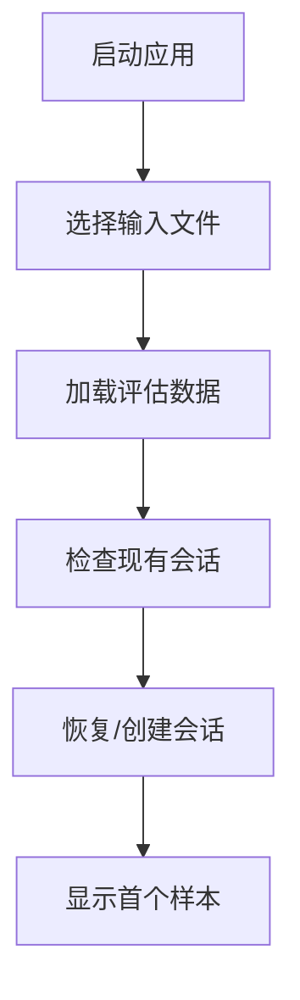
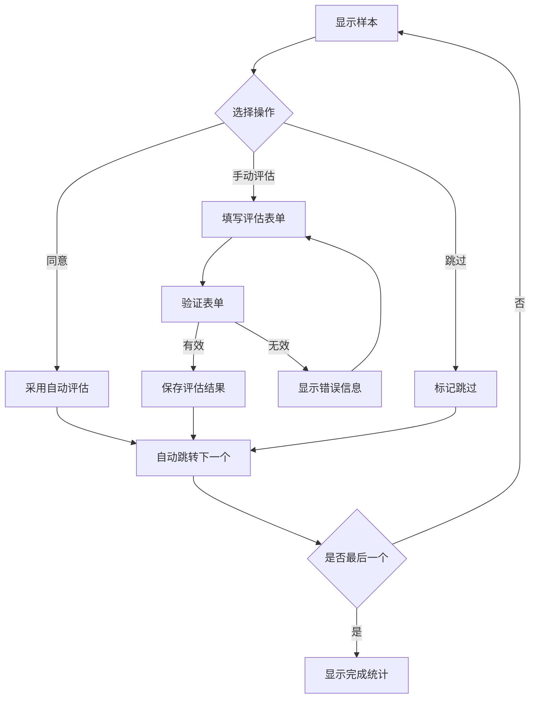
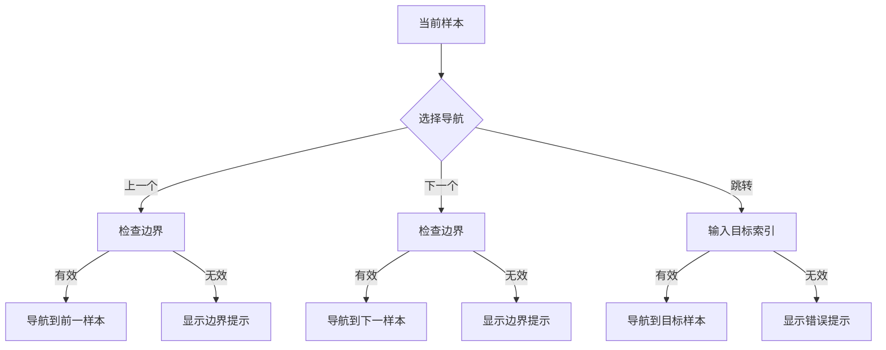

# Gradio Manual Judge Web Application Design

## 概述

将现有的命令行RAG评估复核工具转换为现代化的Gradio Web应用程序，提供丰富的用户界面和优秀的用户体验，支持对自动评估结果进行高效的人工复核和评分。

## 核心功能需求

### 1. 数据管理
- **输入**: 自动评估结果JSON文件（evaluation.py输出）
- **输出**: 人工评估结果JSON文件
- **会话持久化**: 自动保存评估进度，支持中断恢复
- **数据导出**: 支持多种格式导出评估结果

### 2. 评估维度
- **正确性**: AI回答与标准答案的事实一致性
- **完整性**: AI回答包含标准答案的主要信息点程度
- **忠诚度**: AI回答是否存在幻觉或虚假信息
- **备注**: 自由文本评论和说明

### 3. 操作流程
- 逐个样本评估或批量操作
- 同意自动评估结果的快捷操作
- 手动修正评估结果
- 导航控制（上一个/下一个/跳转）

## UI/UX 设计规范

### 设计原则
- **现代简洁**: Material Design 3启发的设计语言
- **信息密集**: 最大化有效信息展示
- **交互高效**: 减少点击次数，提高评估效率
- **视觉层次**: 清晰的信息层级和视觉引导
- **响应式**: 适配桌面和平板设备

### 色彩体系
```css
:root {
  /* Primary Colors */
  --primary-50: #f0f9ff;
  --primary-500: #3b82f6;
  --primary-700: #1d4ed8;
  --primary-900: #1e3a8a;

  /* Semantic Colors */
  --success: #10b981;
  --warning: #f59e0b;
  --error: #ef4444;
  --info: #6366f1;

  /* Neutral Colors */
  --neutral-50: #f8fafc;
  --neutral-100: #f1f5f9;
  --neutral-200: #e2e8f0;
  --neutral-500: #64748b;
  --neutral-700: #334155;
  --neutral-900: #0f172a;
}
```

### 字体系统
- **标题**: Inter/思源黑体, 24px/20px/16px
- **正文**: -apple-system/PingFang SC, 14px/16px
- **代码**: 'JetBrains Mono'/Monaco, 13px
- **标注**: 12px, 次要颜色

## 界面布局设计

### 主布局结构
```
┌─────────────────────────────────────────────────────────────┐
│                        Header Bar                           │
│  Logo | Progress: 5/100 | Session: xxx | Export | Settings  │
├─────────────────────────────────────────────────────────────┤
│                                                             │
│                     Main Content Area                       │
│                                                             │
├─────────────────────────────────────────────────────────────┤
│                      Action Bar                             │
│        Prev | Skip | Agree | Manual | Save | Next          │
└─────────────────────────────────────────────────────────────┘
```

### 主要组件规格

#### 1. Header Bar (固定顶栏)
- **高度**: 64px
- **背景**: 白色/深色主题适配
- **内容**:
  - Logo和应用名称
  - 进度指示器（当前/总数）
  - 会话信息
  - 导出按钮
  - 设置菜单

#### 2. Main Content Area
##### 2.1 Sample Information Panel
```
┌─────────────────────────────────────────────────────────────┐
│ 样本ID: dev-0 | 类型: 事实查询 | 来源: 江苏爱康太阳能        │
├─────────────────────────────────────────────────────────────┤
│ 【问题】                                                    │
│ 江苏爱康太阳能2008年度无形资产投资多少？                   │
└─────────────────────────────────────────────────────────────┘
```

##### 2.2 Answer Comparison Panel (双栏对比)
```
┌─────────────────────────┬─────────────────────────────────────┐
│        AI回答            │            标准答案                  │
│                        │                                     │
│ 根据参考资料中的"重大资 │ 1526.45万元                        │
│ 本性支出"表格，江苏爱康 │                                     │
│ 太阳能2008年度无形资产  │                                     │
│ 投资为1,526.45万元      │                                     │
│                        │                                     │
│ [复制] [查看来源]       │ [复制]                              │
└─────────────────────────┴─────────────────────────────────────┘
```

##### 2.3 Automatic Evaluation Results
```
┌─────────────────────────────────────────────────────────────┐
│ 【自动评估结果】                                             │
│ ✓ 正确性: 通过    ✗ 完整性: 未通过    ✓ 忠诚度: 通过        │
│ 综合评分: 2/3                                               │
└─────────────────────────────────────────────────────────────┘
```

##### 2.4 Manual Evaluation Panel
```
┌─────────────────────────────────────────────────────────────┐
│ 【人工评估】                                                 │
│                                                             │
│ 正确性 ○ 正确   ○ 错误   ○ 部分正确                        │
│ 完整性 ○ 完整   ○ 不完整 ○ 基本完整                        │
│ 忠诚度 ○ 忠实   ○ 有幻觉 ○ 部分幻觉                        │
│                                                             │
│ 评估备注: ┌─────────────────────────────────────────────┐   │
│          │                                             │   │
│          │                                             │   │
│          └─────────────────────────────────────────────┘   │
└─────────────────────────────────────────────────────────────┘
```

##### 2.5 Retrieved Documents Panel (可折叠)
```
┌─────────────────────────────────────────────────────────────┐
│ 【检索文档】 ▼                                               │
│                                                             │
│ 文档1: 江苏爱康太阳能科技股份有限公司.PDF (页码: 259)        │
│ 相关度: 0 | 长度: 1024字符                                  │
│ ┌─────────────────────────────────────────────────────────┐ │
│ │ 招股意向书                                              │ │
│ │ 1-1-258                                                │ │
│ │ 四、重大资本性支出...                                   │ │
│ │ [展开全文] [高亮关键词]                                 │ │
│ └─────────────────────────────────────────────────────────┘ │
└─────────────────────────────────────────────────────────────┘
```

#### 3. Action Bar (固定底栏)
- **高度**: 72px
- **背景**: 浅灰色/深色主题适配
- **按钮**:
  - **上一个**: 导航到前一样本
  - **跳过**: 不评估当前样本，直接下一个
  - **同意**: 采用自动评估结果
  - **手动评估**: 提交当前手动评估
  - **保存**: 保存当前进度
  - **下一个**: 导航到下一样本

### 侧边栏设计（可选展开）

#### Statistics Panel
```
┌─────────────────────────────────────┐
│ 【评估统计】                        │
│                                     │
│ 总进度: ████████░░ 80%              │
│ 已评估: 80/100                      │
│ 今日评估: 15                        │
│ 平均耗时: 45秒                      │
│                                     │
│ 【指标分布】                        │
│ 正确性: ✓ 65  ✗ 15                 │
│ 完整性: ✓ 48  ✗ 32                 │
│ 忠诚度: ✓ 72  ✗ 8                  │
│                                     │
│ 【一致性分析】                      │
│ 与自动评估一致: 75%                 │
│ 主要分歧维度: 完整性                │
└─────────────────────────────────────┘
```

## 交互流程设计

### 1. 应用启动流程


### 2. 评估操作流程


### 3. 导航操作流程


## 技术架构

### 组件架构
```python
# 主应用结构
GradioManualJudge
├── session_manager: SessionManager     # 会话管理
├── data_loader: DataLoader            # 数据加载
├── ui_builder: UIBuilder              # 界面构建
├── evaluation_handler: EvaluationHandler  # 评估逻辑
└── export_manager: ExportManager      # 导出功能

# UI组件模块
UIBuilder
├── header_component()        # 顶栏组件
├── sample_info_component()   # 样本信息组件
├── comparison_component()    # 答案对比组件
├── auto_eval_component()     # 自动评估结果组件
├── manual_eval_component()   # 人工评估组件
├── documents_component()     # 文档展示组件
└── action_bar_component()    # 操作栏组件
```

### 状态管理
```python
@dataclass
class AppState:
    """应用状态管理"""
    current_index: int = 0
    data: Dict[str, Any] = None
    session: JudgeSession = None
    ui_state: Dict[str, Any] = field(default_factory=dict)

    # UI状态
    show_documents: bool = False
    show_statistics: bool = False
    theme: str = "light"
```

### 数据流
```python
# 数据加载 → 状态初始化 → UI渲染 → 用户交互 → 状态更新 → UI更新
def update_sample(index: int) -> tuple:
    """更新样本显示的核心函数"""
    sample = get_sample(index)
    ui_components = render_sample_ui(sample)
    return ui_components

def handle_evaluation(correctness, completeness, faithfulness, notes):
    """处理评估提交"""
    save_evaluation(current_sample, evaluation_data)
    update_progress()
    auto_navigate_next()
```

## 样式系统

### CSS 自定义样式
```css
/* 主题变量 */
.gradio-container {
  --primary-color: #3b82f6;
  --success-color: #10b981;
  --warning-color: #f59e0b;
  --error-color: #ef4444;
  --border-radius: 8px;
  --shadow: 0 1px 3px rgba(0, 0, 0, 0.1);
}

/* 组件样式 */
.sample-card {
  border: 1px solid var(--neutral-200);
  border-radius: var(--border-radius);
  padding: 1.5rem;
  margin: 1rem 0;
  box-shadow: var(--shadow);
}

.comparison-panel {
  display: grid;
  grid-template-columns: 1fr 1fr;
  gap: 2rem;
  margin: 1rem 0;
}

.evaluation-metrics {
  display: flex;
  gap: 2rem;
  align-items: center;
  padding: 1rem;
  background: var(--neutral-50);
  border-radius: var(--border-radius);
}

.action-button {
  min-height: 44px;
  padding: 0 2rem;
  border-radius: var(--border-radius);
  font-weight: 500;
  transition: all 0.2s ease;
}

.progress-bar {
  height: 6px;
  background: var(--primary-color);
  border-radius: 3px;
  transition: width 0.3s ease;
}
```

### JavaScript 增强功能
```javascript
// 键盘快捷键支持
document.addEventListener('keydown', function(e) {
    if (e.ctrlKey || e.metaKey) {
        switch(e.key) {
            case 'ArrowLeft': navigatePrevious(); break;
            case 'ArrowRight': navigateNext(); break;
            case 'Enter': submitEvaluation(); break;
            case 's': saveProgress(); break;
        }
    }
});

// 自动保存功能
let autoSaveTimer;
function scheduleAutoSave() {
    clearTimeout(autoSaveTimer);
    autoSaveTimer = setTimeout(saveProgress, 30000); // 30秒自动保存
}
```

## 高级功能

### 1. 快捷操作
- **键盘导航**: 方向键控制样本切换
- **快捷评估**: 数字键快速选择评估结果
- **批量操作**: 选择多个样本进行批量评估
- **智能建议**: 基于历史评估模式的智能建议

### 2. 数据可视化
- **进度图表**: 实时显示评估进度和完成率
- **指标分布**: 各维度评估结果的分布图
- **一致性分析**: 人工评估与自动评估的一致性分析
- **时间统计**: 评估耗时统计和效率分析

### 3. 导出功能
- **评估报告**: 生成详细的评估报告（PDF/HTML）
- **数据导出**: 支持JSON、CSV、Excel格式导出
- **统计摘要**: 导出评估统计摘要
- **会话备份**: 完整会话数据备份

### 4. 协作功能
- **多用户支持**: 支持多个评估者同时工作
- **评估者一致性**: 计算不同评估者间的一致性
- **仲裁模式**: 对分歧样本进行仲裁评估
- **评估历史**: 保留完整的评估历史记录

## 性能优化

### 1. 加载优化
- **懒加载**: 大型文档内容按需加载
- **预缓存**: 预加载相邻样本数据
- **压缩传输**: 启用数据压缩传输
- **CDN加速**: 静态资源CDN加载

### 2. 渲染优化
- **虚拟滚动**: 大列表使用虚拟滚动
- **组件缓存**: 缓存不变的组件渲染结果
- **增量更新**: 只更新变化的UI部分
- **防抖处理**: 用户输入防抖处理

### 3. 内存管理
- **数据分页**: 大数据集分页加载
- **垃圾回收**: 及时清理不用的数据引用
- **状态压缩**: 压缩存储状态数据
- **缓存清理**: 定期清理过期缓存

## 可访问性

### 1. 键盘支持
- **Tab导航**: 完整的键盘Tab导航支持
- **快捷键**: 提供常用操作的键盘快捷键
- **焦点管理**: 合理的焦点管理和视觉反馈
- **跳转链接**: 提供内容跳转链接

### 2. 屏幕阅读器
- **语义标签**: 使用正确的HTML语义标签
- **ARIA标签**: 提供必要的ARIA标签
- **替代文本**: 为图像提供替代文本
- **结构清晰**: 保持清晰的文档结构

### 3. 视觉辅助
- **高对比度**: 支持高对比度模式
- **文字缩放**: 支持文字大小调整
- **色彩友好**: 不仅依赖颜色传递信息
- **动画控制**: 提供动画开关选项

## 部署配置

### 1. 环境要求
```python
# requirements.txt
gradio>=4.0.0
pandas>=1.5.0
matplotlib>=3.5.0
plotly>=5.0.0
```

### 2. 启动配置
```python
# 启动参数
app = gr.Blocks(
    theme=gr.themes.Soft(),
    title="RAG Manual Judge",
    css="custom.css",
    js="custom.js"
)

# 服务器配置
app.launch(
    server_name="0.0.0.0",
    server_port=7860,
    share=False,
    debug=False,
    auth=None,  # 可配置认证
    ssl_verify=False
)
```

### 3. 启动参数
```
  parser = argparse.ArgumentParser(description='RAG 评估结果人工复核工具')
  parser.add_argument('--input_file', required=True, 
                      help='评估结果输入文件 (来自 evaluation.py 的输出)')
  parser.add_argument('--judge_results_file', required=True,
                      help='人工评估结果输出文件')
  parser.add_argument('--host', default='0.0.0.0',
                      help='服务器主机名 (默认: 0.0.0.0)')
  parser.add_argument('--port', default=7860, type=int,
                      help='服务器端口号 (默认: 7860)')
  
  args = parser.parse_args()
```

## 总结

这个设计文档提供了将CLI工具转换为现代Web应用的完整规划，重点关注:

1. **用户体验**: 现代简洁的界面设计，高效的交互流程
2. **功能完整性**: 保持原有所有功能，并增强用户友好性
3. **技术架构**: 清晰的组件分离和状态管理
4. **扩展性**: 支持未来功能扩展和多用户协作
5. **性能优化**: 考虑大数据集的性能需求
6. **可访问性**: 确保所有用户都能有效使用

通过这个设计，用户将获得比原始CLI工具更加丰富、高效和友好的评估体验。